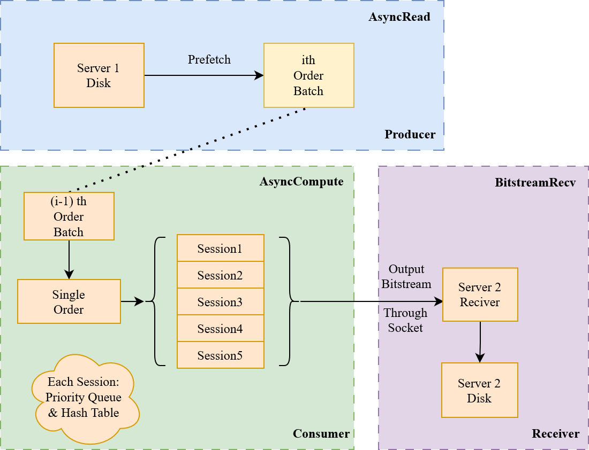
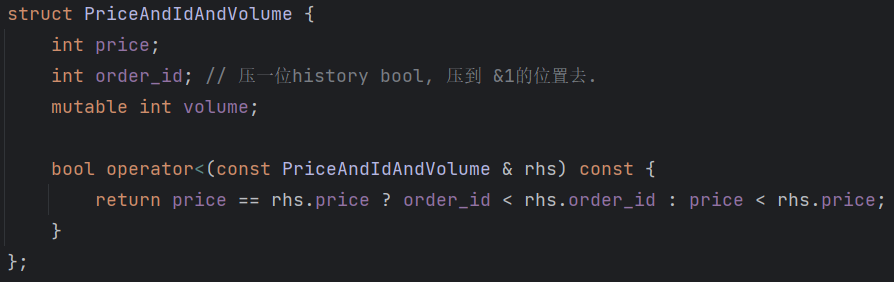

# 技术报告——By 三卜白水

Team 09 队伍成员：张辛宁，石蒙，张若琦

## Introduction

我们基于C++17实现了一个基于生产者消费者模型的多线程订单撮合系统，使用大小根堆优化订单撮合的过程，并在注重代码质量与代码可读性的前提下，极致地优化了系统性能，使得在运行过程中磁盘I/O始终可以达到峰值350MB/s，达到了**理论的处理速度极限**。

## Architecture

我们程序的架构图如下图所示: 




根据订单撮合系统题目中的需求，我们需要从Server1的磁盘中读取1.5T的二进制数据，使用Server1和Server2的全部资源完成订单撮合，并把最终答案保存到Server2的磁盘上。

由于独立地考虑每个交易日，我们可以使用多进程的方式计算每个交易日的结果。对于一个进程来说，它计算了某一个特定的交易日。我们使用生产者消费者模型，将对应交易日的历史订单分批次读取，并维护到信息队列中，当信息队列非空时，消费者被唤醒，处理信息队列中的每一批历史订单。由于题目要求输出不同的SessionNum和SessionLength的策略单，对于每一批订单的每个订单，可以在多个Session之间进行进行复用。在消费者处理完生产者产生的所有数据后，进程会将计算好的答案以二进制的字节流发送到Server2中。Server2对于接收到的字节流以二进制写的方式直接写到Server2的磁盘中，完成每个交易日的全部流程。

## 工作流程

1. 在Server1上，运行和CPU核数相同的进程，读取每个独立的交易日数据。
2. 对于每个进程：
   - 首先读取**前一日交易信息**与**信号**，并缓存在内存中。
   - 其次使用**生产者-消费者模型**，生产者将批量读取的**历史交易信息**维护在队列中，消费者在队列非空时对于每批历史交易信息进行处理。
   - 对于消费者，每次提取当前需要撮合的历史交易信息，并维护当前的时间戳，如果存在信号，则在撮合历史交易后，对策略单进行撮合。
   - 由于历史交易信息涉及不同的合约，每个合约互相独立，我们为每个合约建立两个堆(小根堆(用于卖方), 大根堆(用于买方))，并使用哈希表来映射合约。
   - 在撮合订单的过程中，我们根据不同的交易类型(type=0...5)分别对堆进行维护操作。
     - 每个堆内维护过去的限价历史订单(与策略单)，记录时间戳，价格与"还剩多少仓位没有成交"。成交时，取出堆顶元素并进行对应仓位的修改。
     - 为了快速判断类型5是否可以成交，每个合约内部的两个堆需要维护堆内元素的和。
     - 在维护过程中，计算策略单产生的现金变化与策略单仓位用于pnl与postion答案的输出。
3. 当一个进程完成处理当日的全部数据后，它将计算出的策略单，pnl与仓位直接以二进制bitstream的方式通过socket传输到Server2中。
4. Server2将接收到的数据直接以二进制文件的方式写入到磁盘中。


## 性能分析

系统的性能开销主要来源于下面**两个方面**:

首先是**I/O方面**：包含**磁盘读取、输出、与网络传输**三个方面。

1. 给定的磁盘的读写速度: $\frac {1.5TB} {350MB/s} = 4285s$ 约**一小时**左右的时间，可能成为性能瓶颈。

   - 需要采取异步计算与读入，否则CPU会一直处于空闲状态。
   - 同一个交易日的每个历史订单都会在不同的策略上复用，如果对于不同的策略重新读取历史订单数据到磁盘中，会显著增加磁盘读入的次数。

2. 服务器网络带宽实测1.5GB/s，远远高于磁盘读取速度，每个交易日中，每个Session输出的答案大小约为4MB，无法构成传输瓶颈。

3. 每个交易日中，每个Session输出的答案大小约为4MB，但由于输出是在Server2上进行，无法构成输出瓶颈。

   

其次是**CPU计算方面**：主要开销来源于两种高频操作，**堆的使用**与**哈希映射**。

1. 在考虑独立的交易日时，对于每一个合约，维护**大根堆和小根堆**对应买方价格和卖方价格，几乎对于每个历史订单都会有一次堆的操作，高频的堆操作可能成为CPU计算的瓶颈。
2. 在考虑独立的交易日时，对于每一个合约，需要找到对应合约所在堆的**映射**，每次调用堆时，7位字符的映射会大大增加映射的成本，高平的哈希映射可能成为CPU计算的瓶颈。


## 性能优化流程

我们将分别介绍朴素算法，并结合上述文章里的性能分析，提出基于I/O和CPU的优化。


### 朴素算法

朴素的架构没有多线程部分，即不存在生产者/消费者模型。

在磁盘完成一批历史订单的数据读取后，将历史订单加入到撮合系统中，对于每个策略单都重新读取历史订单。

对于撮合系统堆的元素更新，我们采取pop堆顶元素，并重新加入一个新的元素的过程，哈希算法采用unsigned long long，把8个字节映射为一个long long的值并存入unordered map中。

朴素算法的运行时间为: **33s.**

### 优化点1(I/O): 生产者/消费者模型 + 历史订单复用 + 充分利用cache

1. 由于I/O时CPU陷入空闲，我们使用双线程的**生产者消费者模型**，这使得异步的计算与读取成为了可能。

2. 同时根据性能分析的磁盘读取部分，可以分析出历史交易需要在内存中常驻，否则需要多次磁盘I/O，因此对于可以每个独立交易日**复用历史交易信息**，只读取1次硬盘，暂存数据到内存里。

3. 每个策略需要复用历史交易信息，我们可以从一批读的历史交易信息中，一条一条地获取交易信息，这样有利于缓存的友好。

   - 具体来说，下面这段代码，**前者要更加缓存友好**。

   - ```python
     for order in order_batch:
        for worker in workers:
           worker.deal(order);
             
     for worker in workers:
        for order in order_batch:
           worker.deal(order);
     ```

   经过我们的三步优化，运行时间: **33s -> 26s!**

​	（图片太大，见read.png和deal.png）


## 优化点2(CPU)：堆的调用

1. 我们需要支持"修改堆顶元素"这一操作，priority_queue是不支持直接返回堆顶元素的引用的，然而这可以通过某种方式实现:

   - 通过mutable关键字，可以修改堆顶元素的value值，借助这一特性，意味着我们可以轻松修改堆顶的仓位(如下图)。

     ```c++
     struct Foo{
     	int key;
     	mutable int value;
     };
     ```

2. 在朴素版本的大小根堆里，我们使用了一个小trick: 在堆顶压入负数值来维护默认的大根堆，这样可以让我们以大根堆的方式来维护小根堆，诚然这为我们的代码书写带来了便利，但是增加一个负号的运算开销也不容小觑，因此我们单独拆分了大根堆和小根堆，以增加代码长度为代价节省了若干个负号运算的开销。

   

经过我们优化堆的调用，运行时间: **26s->23s!**


## 优化点3(CPU)：哈希映射优化

理论上我们在维护unordered_map的过程中，键值必须为`char instrument_id[8]`，但首先，我们可以对字符串进行unsigned long long映射，这样可以更好地作为unordered_map的键值。

事实上，unordered_map存在一个强大的对于unsigned long long的优化: 返回它自身。

这省去了很多哈希计算时间，但**计算unsigned long long**值依然是一个不小的开销，而且需要维护一个**很大的哈希表**，也可能出现**哈希冲突**。

注意到，在给出的样例数据中，所给的合约代码都是“XXX.UBE”的形式，这是一个含有7位字符的字符串，并且合约只有150个。

char的取值范围是(-128~127)，但ascii字符串的字符范围只有(0~127)的值，意味着我们对于1个char可以省下1bit空间。

考虑到题目中的合约代码的特殊性，我们可以使用一个特殊的哈希方法: 

枚举字符串中的3个位置，取首个字符的后两个bit, 第二个字符的后7个bit，第三个字符的后7个bit作为hash key，找到哈希冲突最小的3个位置，对于每个合约，计算这3个位置对应的hash key。

这意味着我们可以仅仅使用65536大小(2^16)就可以完成合约名称的哈希。

针对样例，选出的最优三个位置是前三位，经过实验检验，我们使用这三个位置进行哈希可以实现完全无冲的哈希，这样我们解决了之前提到的3个问题: 

1. 计算哈希/计算unsigned long long: 计算一次short的值后，直接存入数组中，免去了重复计算哈希与哈希值计算困难的问题。
2. 哈希表空间开销：我们仅使用了65536大小的哈希表。
3. 哈希冲突：我们使用这种方式，找出了最小冲突的哈希方法，并且在样例的合约中完成了无冲突哈希。


经过我们优化哈希映射，运行时间: **23->21s!**


在我们使用大规模数据测试过程中，发现**磁盘I/O已经达到了瓶颈**，随着磁盘的读取时间变长，CPU的开销从100%逐渐下降，而磁盘的读取速度却一直达到满速，已经失去了继续优化CPU的意义，**对于当前磁盘速度下，我们已经到达了极致性能**。


## 一些零散的Trick:

1. 比较神奇的编译选项，比如使用release版本、打开O2开关等等，详情见CMakeLists.txt.
2. 压位:
   - 比如历史单和策略单的timestamp比大小，可以把timestamp左移一位，如果是策略单就+1，这样能保证同一时刻历史单时间戳小于策略单。
3. 优化数字计算 & 精度控制：
   - double的计算很慢，由于人民币只有2位小数，我们使用int来代替double。具体方法就是*100.
   - double计算有精度误差，依旧是使用int计算，随后保留后3位，到50四舍五入。需要注意的是现金可能很大，需要用long long来存储。

## 展望

对于当前磁盘的磁盘速度，我们采取了诸多优化方式，压榨极致的性能。但对于不以磁盘I/O速度为瓶颈的系统下，这个架构依旧存在很大的优化空间。

1. Server2可以接收来自Server1的历史交易数据，这意味着通过zero-copy技术可以优化网络的传输过程，同时缓解Server1 CPU的计算压力。
   - 我们已经使用`ethtool -k eth0 | grep scatter-gather`命令检验了该内核是否支持zero-copy，答案是肯定的。
2. 在Server1上存在NUMA核，这意味着绑核可以大大提高CPU的运行效率，需要探索一种执行方式，充分利用NUMA核的特性。
3. 在实际交易过程中，Type=3...5这些类型并不是由交易所直接给出，而是需要程序推断的，这需要我们进一步完善订单撮合系统。


## 尾声

感谢九坤投资为我们提供了免费的服务器，以及质量非常非常优秀的题目，感谢九坤工作人员对我们的热情帮助&答疑解惑。

我们的队员都是计算机科学专业的学生，之前也不熟悉题目中提到的金融知识。但在精读了比赛题目的文档后，对于整个订单撮合系统、包括如何成交订单、如何把自己的策略单执行到撮合系统的整个流程都有了很深刻的认识，对深交所的交易规则也有了从0到1的了解。

也许这个项目就是我们走向QD的第一步(笑)~

